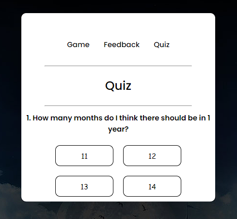

#Tic-Tac-Toe

# Introduction

- As my first ever game to create, i created Tic-Tac-Toe, it is a simple game and was a great start for me.

- A feedback page, where you can fill out your name, email and message that you want to send me, a pop up will show when you send me an message and a popup will show if you dont filled it out correctly.

- I also created a Quiz, that was interesting and fun, i got to play around with different kinds of code, i got to add some effects and estetics that were really cool to create.

## Design
For this project i chose to use a dark background for a more cozy enviroment and a more cozy feeling to the experience.
## User-Goals

 - Replayable game with a friend.
 - Easy to understand.

## Technologies Used

### Sources
- YouTube
- Google
- Visual Studio Code

### Languages
- HTML
- CSS
- JavaScript
## Features
#### Mainpage

#### Someone Wins!

#### Feedback page

#### Sends a message

#### Error

#### Quiz page

#### Wrong answer on quiz

#### End Screen of quiz

